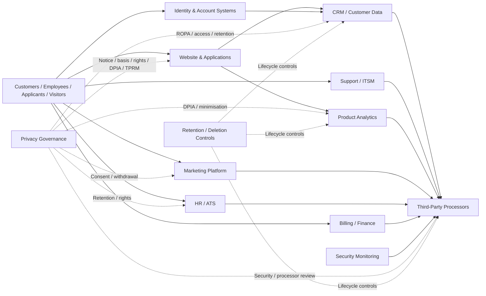

# Privacy Data-Flow Diagram — Northstar Cloud Services

> Simplified simulated architecture for portfolio use. It shows where personal data enters, how it is used, and where privacy governance controls apply.

## Governance Control Points

The diagram is intentionally simple. In a real environment, the processing inventory would be linked to system owners, data stores, processors, transfer locations, retention rules and applicable safeguards.

The key portfolio objective is traceability:

**Data Subject / Principal → Processing Activity → System → Processor → Privacy Control → Evidence → Risk → Remediation**
