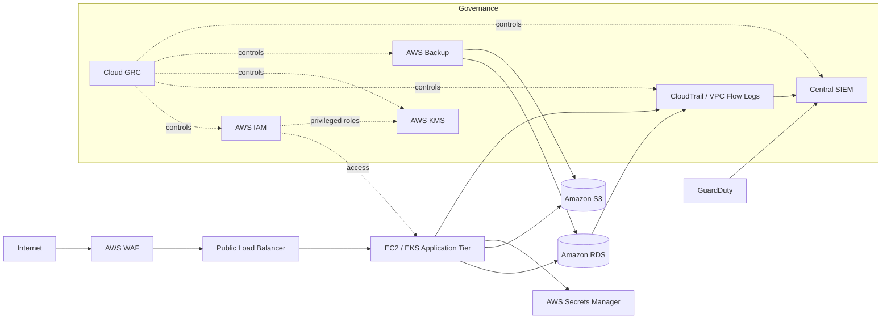

# Simulated Cloud Security Architecture — Northstar

## GRC Control Points

The architecture is designed to make control ownership visible:

**External Exposure → WAF / Network → Workload → Data Stores → Identity / Secrets → Logging → Detection → Recovery**

The portfolio assessment then attaches evidence, findings and remediation actions to those control points.